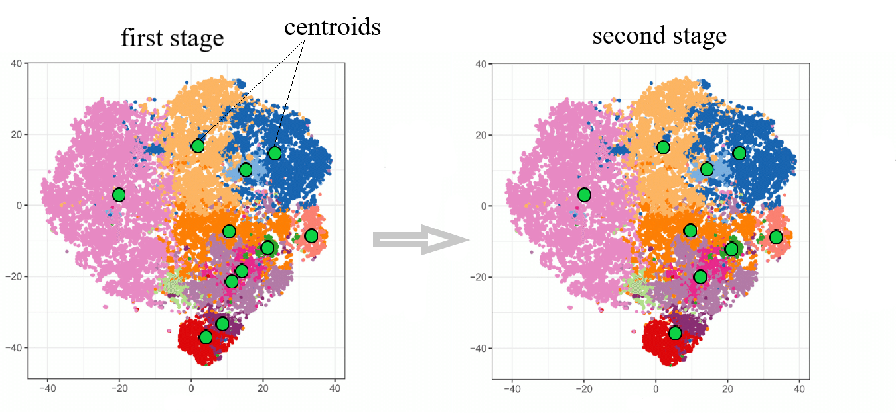

# kmeans_importantCluster
Seeded kmeans with important cluster

## Supervised data clustering
In this project, I am going to cluster labeled data using kmeans algorithm.
We can compare the clustering results with the classes and see how different they are.
  It is done in this way that the primary centroids are the average of each class so that we can have representatives from all classes.

Also, we will consider the distances between the centers of pairs of classes, which will be merged if each of these pairs is less than the specified distance.

